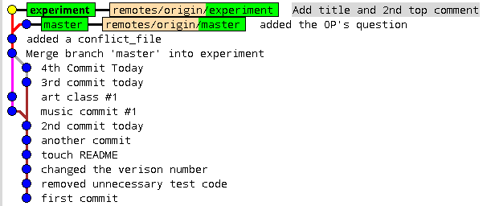

# Lukas's scratchpad of Github tips

**I did many small commits here to learn about ```git```, so forking this repo will clutter your commit history.**  
**I recommend you download zipfile and copy into new repo. Or use ```git clone --depth 1 https://github.com/lahoffm/github_help.git```.**

## Nice tutorials & guides
* [Pro Git ebook](https://git-scm.com/book/en/v2)
* [Github for beginners](https://readwrite.com/2013/09/30/understanding-github-a-journey-for-beginners-part-1/)
* [An intro to Git and Github for beginners](http://product.hubspot.com/blog/git-and-github-tutorial-for-beginners)
* [Git - the simple guide](http://rogerdudler.github.io/git-guide/)
* [Software carpentry](https://swcarpentry.github.io/git-novice/)
* [Atlassian git tutorials](https://www.atlassian.com/git/tutorials/)
* [Git concepts simplified](http://gitolite.com/gcs.html#(1))
* [Github visual guide](http://marklodato.github.io/visual-git-guide/index-en.html)
* [Gitk tutorial](https://lostechies.com/joshuaflanagan/2010/09/03/use-gitk-to-understand-git/)
* [Aha moments when learning git](https://betterexplained.com/articles/aha-moments-when-learning-git/)
* [A successful git branching model](http://nvie.com/posts/a-successful-git-branching-model/)
* [Git best practices](https://gist.github.com/pandeiro/1552496)

## Nice cheatsheets
* [PDF from rogerdudler.github.io/git-guide](git_cheat_sheet.pdf)
* [PDF from education.github.com](git-cheat-sheet-education.pdf)
* [PDF, Markdown cheatsheet from Github Guides](markdown-cheatsheet-online.pdf)

## Simple pipeline (*best practice: don't commit to master, commit to branches then merge into master*)
```git status```  
```git add -A``` - track files in staging area for commits  
```git diff``` - [see changes](https://stackoverflow.com/questions/2529441/how-to-read-the-output-from-git-diff)  
```git commit -am "message"``` - commit tracked files to local computer  
```git push origin master``` - sync local master branch to online repo  

## Working with branches
```git checkout -b mybranch``` - switch to branch (```-b``` is to create & checkout in 1 step)  
```git branch``` - list branches in repo and current branch  
```git add -A``` - if files were staged in master they are also staged in branch but good to do in case new files are made  
```git commit``` as usual within the branch  
```git push origin mybranch``` - sync local mybranch branch to online repo  
```git merge mybranch --no-ff --m "merging mybranch into current branch"``` - mybranch = name of branch you want to merge with current branch (such as master).
**Make sure you're in the branch you want to merge to!** ```--no-ff``` - no fast-forward (can add or reduce confusion on case-by-case basis)  
* Solve merge conflict
	* Open file with conflict
	* Delete conflict marker lines containing ```<<<<<<<```, ```=======```, ```>>>>>>>```
	* Make the changes you want to see in the final merge
	* Save file
	* ```git add .```
	* ```git commit -m "resolved merge conflict"```  

```git branch -d mybranch``` - delete local branch  
```git push origin --delete mybranch``` - delete remote branch  
```git push origin master``` - don't forget to push "the branch that you merged into" to the remote too!  
```gitk --all``` - [visualize commit tree](https://lostechies.com/joshuaflanagan/2010/09/03/use-gitk-to-understand-git/)  




## [Undoing](https://github.com/blog/2019-how-to-undo-almost-anything-with-git) [commits](https://www.atlassian.com/git/tutorials/resetting-checking-out-and-reverting) (Only use locally)

* Restoring single file locally
```HEAD``` - most recent commit, ```HEAD~1``` = one commit before ```HEAD```  (read the docs on how HEAD pointers work)
```git log --oneline -5``` - see unique identifiers for last 5 commits  
```git log --patch src/helloworld.py``` - narrow down which commit you want to restore (gives list of SHAs - Secure Hash Algorithm values uniquely identifying the commit)  
```git checkout c6fab02 src/helloworld.py``` - checkout a file from the commit whose SHA started with ```c6fab02```  
```git commit –am “restore helloworld.py from commit c6fab02”```  - commit the file you checked out, which was from an earlier commit
* Restore everything locally to where it was after a prior commit (*use with caution*)
```git reset --hard c6fab02```  
* Undo the most recent commit  (```--hard``` removes changes to files, but ```--soft``` keeps changes)  
```git reset --hard HEAD~1```  
* Make a new branch starting at a previous commit  
```git checkout c6fab02; git checkout –b mybranch```
* Undoing a merge
	* Haven't tried this but here's [two](http://www.deferredprocrastination.co.uk/blog/2012/git-un-merge/) [sites](https://mijingo.com/blog/reverting-a-git-merge)
* Restore after pushing to remote repo  
```git revert``` - but safest way is to just fix the bad code locally and push a new commit  

## Other useful commands 
```git remote -v``` - remote URLs (such as origin)  
```git ls-remote``` - references in remote repo  
```git ls-tree -r master``` - list all committed files in branch named "master"  
```git commit -m "message" path/to/my/file.ext``` - commit a single file (```./file.ext``` commits to file in root folder)  
```git add newdir/; git commit -m "message"``` - commit a single folder and recursively commit all of its subfolders too  
```git reset HEAD``` - clear the staging area  

## Instructions to contribute to group project repos - still in draft form
* ```git pull origin master``` - clone current copy of origin to local master branch  
* [Git Pro Section 6.2 - Contributing to a Project](https://git-scm.com/book/en/v2/GitHub-Contributing-to-a-Project)
* Use git fetch/merge instead of just git pull?
* git tag?


* git clone the repo into own computer, then fork the repo (in browser)
* cd to the folder ht-archive
* git branch, should say master
* git remote rename origin upstream 
* git remote add origin <your_url> such as https://github.com/lahoffm/ht-archive.git (the URL you see in browser when you click on the “Clone or Download”)
* git branch my_branch_name [no spaces] - whenever you start working on something
* git checkout my_branch_name
* git status - should say you are on branch my_branch_name instead of master
* Now start working on the code
* git commit
* git push origin my_branch_name - pushes the branch to your fork of ht-archive online
* git checkout master - go back to master
* git pull -r upstream master - pull from the upstream code (anidata/ht-archive) into master
* Now if you do git checkout my_branch_name, then git pull -r upstream master then the branch will be updated into the latest version of the upstream repo (anidata/ht-archive)?? Not sure if this is how it works.
* Philosophy: you want your local “master” to always be up-to-date with the upstream repo (i.e. anidata/ht-archive) and then you work on your local branch (which you push to your fork online)

